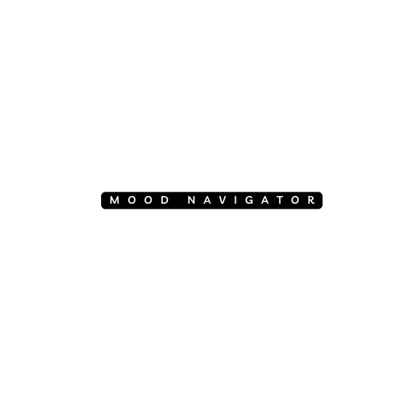
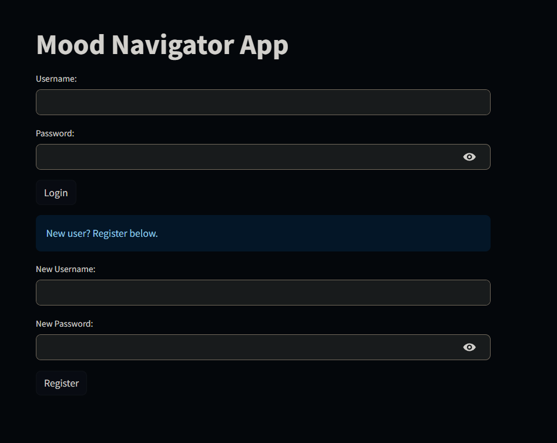
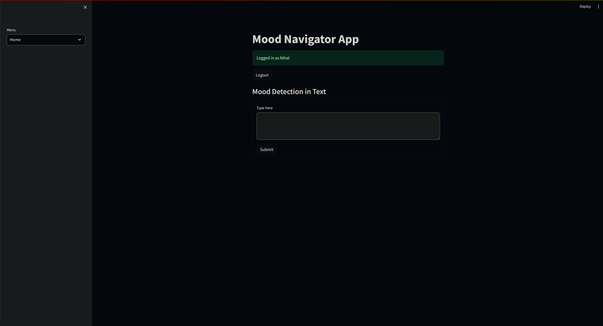

<a name="readme-top"></a>


<!-- PROJECT LOGO -->
<br />
<div align="center">
  <a href="https://github.com/github_username/repo_name">
    
  </a>

<h3 align="center">Mood Navigator</h3>

  <p align="center">
    An innovative application harnessing the power of natural language processing and artificial intelligence, designed to function as your personal diary while offering valuable insights into your emotions. Tailored for younger generations, especially teenagers who may find it challenging to express their feelings openly, this app provides a safe outlet for sharing emotions and facilitates personal growth and self-improvement.
    <br />
  </p>
</div>


<!-- TABLE OF CONTENTS -->
<details>
  <summary>Table of Contents</summary>
  <ol>
    <li>
      <a href="#about-the-project">About The Project</a>
      <ul>
        <li><a href="#built-with">Built With Streamlit</a></li>
      </ul>
    </li>
    <li>
      <a href="#getting-started">Getting Started</a>
      <ul>
        <li><a href="#prerequisites">Prerequisites</a></li>
        <li><a href="#installation">Installation</a></li>
      </ul>
    </li>
  </ol>
</details>


<!-- ABOUT THE PROJECT -->
## About The Project



<!-- GETTING STARTED -->
## Getting Started

To run your own local version of the Mood Navigator, simply follow the steps below

### Prerequisites

Before you begin to import and run the app
* pip install using the requirements.txt file provided
  ```sh
  pip install -r requirements.txt
  ```

### Installation

1. Clone the repo
   ```sh
   git clone https://github.com/itsxorf/Mood-Navigator.git
   ```
2. Install streamlit extension in Visual Studio Code

4. Navigate to the project folder

5. Open a new terminal window

3. Enter the following command into the terminal
   ```sh
   streamlit run app.py
   ```

<p align="right">(<a href="#readme-top">back to top</a>)</p>


